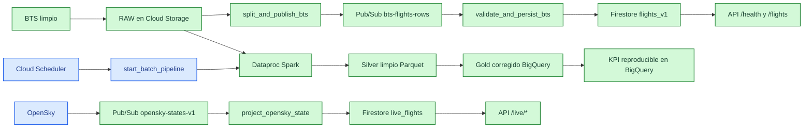

# Flujo Implementado en Sprint 1

## Objetivo

Mostrar el flujo de datos demostrado en Sprint 1.

## Leyenda

- `Verde`: flujo validado
- `Azul`: soporte operativo del sprint

## Diagrama

```mermaid
flowchart LR
    BTS[BTS limpio]
    RAW[RAW en Cloud Storage]
    SPLIT[split_and_publish_bts]
    PUB[Pub/Sub bts-flights-rows]
    PERSIST[validate_and_persist_bts]
    FSB[Firestore flights_v1]
    API[API /health y /flights]

    SCH[Cloud Scheduler]
    ORCH[start_batch_pipeline]
    DP[Dataproc Spark]
    SILVER[Silver limpio Parquet]
    GOLD[Gold corregido BigQuery]
    KPI[KPI reproducible en BigQuery]

    OS[OpenSky]
    OSPUB[Pub/Sub opensky-states-v1]
    PROJ[project_opensky_state]
    FSL[Firestore live_flights]
    LIVEAPI[API /live/*]

    BTS --> RAW --> SPLIT --> PUB --> PERSIST --> FSB --> API
    RAW --> DP --> SILVER --> GOLD --> KPI
    SCH --> ORCH --> DP
    OS --> OSPUB --> PROJ --> FSL --> LIVEAPI

    classDef green fill:#d3f9d8,stroke:#2b8a3e,color:#1b4332,stroke-width:1.5px;
    classDef blue fill:#dbeafe,stroke:#2563eb,color:#1e3a8a,stroke-width:1.5px;

    class BTS,RAW,SPLIT,PUB,PERSIST,FSB,API,DP,SILVER,GOLD,KPI,OSPUB,PROJ,FSL,LIVEAPI green;
    class SCH,ORCH,OS blue;
```
