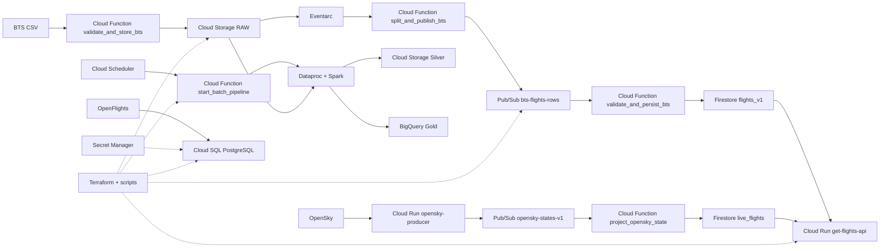

# Mapeo Tecnologico GCP - Sprint 1

## Objetivo

Documentar los servicios de GCP usados en la implementacion validada de Sprint 1.

## Diagrama

## Servicios documentados

- Cloud Storage RAW y Silver
- Eventarc
- Pub/Sub batch y live
- Cloud Functions de validacion, particion, proyeccion y orquestacion
- Dataproc para batch con Spark
- BigQuery como capa Gold
- Firestore para serving de Sprint 1
- Cloud Run para API y productor live
- Cloud SQL para maestros OpenFlights
- Secret Manager para la credencial de Cloud SQL
- Terraform y scripts de soporte
